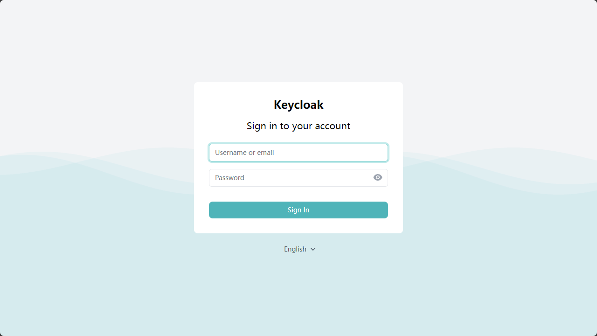
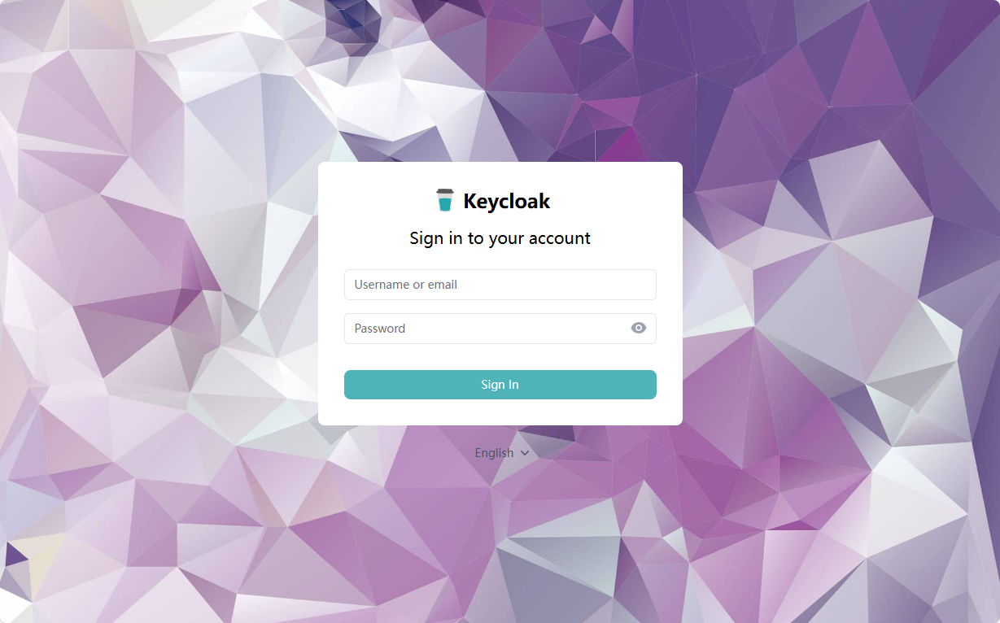
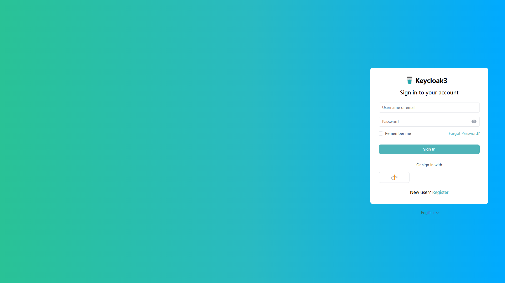
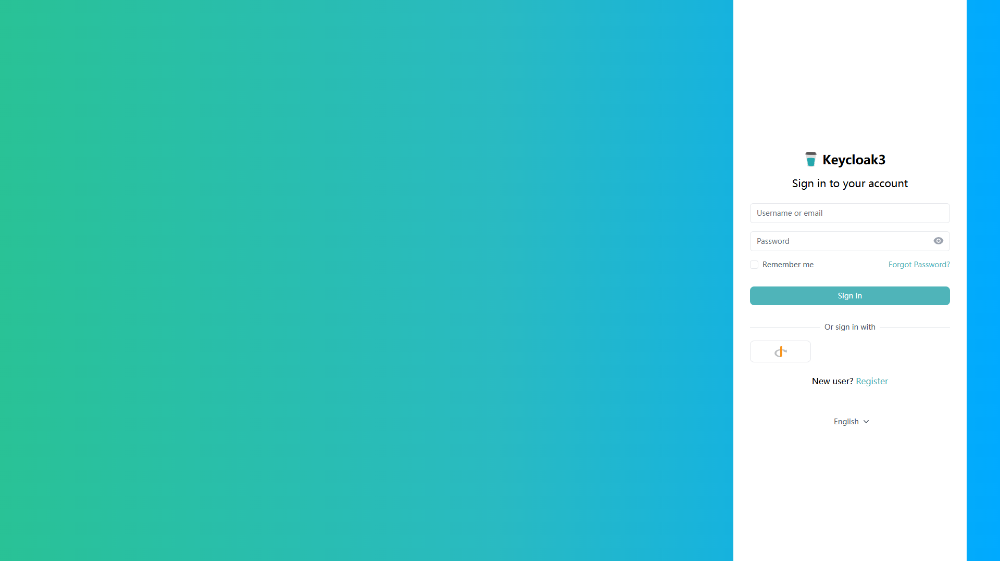
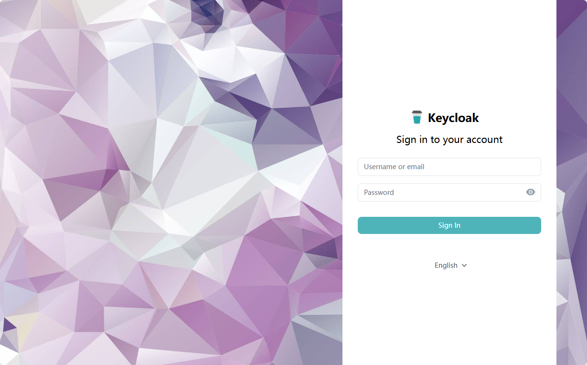
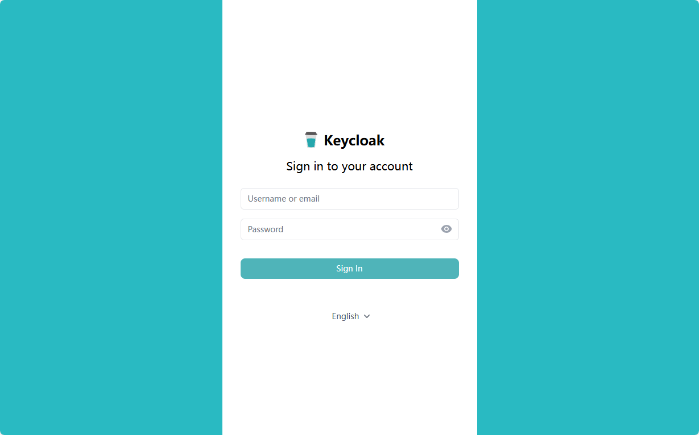

# :wind_face: Keywind Extend :wind_chime:

mint-keywind-theme is an extend to [Keywind](https://github.com/lukin/keywind)

## Overview

While inheriting all the existing features of Keywind, this repository also includes the following optimizations and updates:

- Add the ability to create multiple theme colors for different themes.
- Add the ability to customize the welcome page.
- Additional Theme: keywind-mint-flavor.

## Customize or Develop

```shell
# Install dependencies
yarn install
# Update tailwind css artifact by current project
yarn build
# Build the actual JAR file used for the Keycloak deployment.
yarn build:jar
```

## Features

### Color schema for multi-theme

This repository allows you to create unique theme colors for different themes based on Keywind.

After creating a new custom theme, you need to override the `login/template.ftl` file, and change the value of the `data-theme` field to the name of your custom color scheme.

Create your color pattern in `tailwind.config.ts`:

```js
// Change this segment in tailwind.config.ts
createThemes({
  // If you just want switch to another predefined tailwind colors:
  // Color reference: https://www.tailwindcss.cn/docs/customizing-colors
  'name-of-your-custom-color-scheme': {
    primary: colors.blue,
    secondary: colors.gray,
    provider: providerColors,
  },
  // If you want completely customize the theme color:
  'name-of-your-custom-color-scheme': {
    primary: {
      50: '#eff6ff',
      100: '#dbeafe',
      200: '#bfdbfe',
      300: '#93c5fd',
      400: '#60a5fa',
      500: '#3b82f6',
      600: '#2563eb',
      700: '#1d4ed8',
      800: '#1e40af',
      900: '#1e3a8a',
      950: '#172554',
    },
    secondary: ..., // data structure is same as primary color.
    provider: providerColors,
  },
});
```

You can use the same color scheme in multiple custom themes, just specify the same color scheme name in the `data-theme` field inside of the `login/template.ftl`.

### Customizable welcome page

If you don't want to expose your Keycloak welcome page to the public, after deploying keywind to your Keycloak server, setting `KC_SPI_THEME_WELCOME_THEME=keywind` in the environment variables (or `--spi-theme-welcome-theme` in cli) will override the default welcome page.

By default, when this feature is enabled, visiting `yourkeycloak.domain` will no longer display the welcome page, but will be redirected to `yourkeycloak.domain/admin/master/console`. To adjust this behavior or completely customize the welcome page, you can modify the `theme/keywind/welcome/index.ftl` file.

Technical reference:

- [discussion by nicolas-goudry](https://github.com/keycloak/keycloak/discussions/10467).
- [Keycloak - Configuring a theme](https://www.keycloak.org/docs/23.0.4/server_development/index.html#configuring-a-theme)

## Theme variation

### keywind

#### Preview


#### Description

This is the original Keywind theme, with adjustments to the language selector style and the addition of a custom welcome page feature. This theme is used as the base theme for all theme variations in this repository.

If you need to create a new theme based on Keywind, you would need to correspondingly create `login` and `welcome` folders, and within each folder, create a `theme.properties` file. In this file, you need to fill in `parent=keywind`. At this point, creating the same-named file in the same directory within your theme folder will override the corresponding pages in the Keywind theme.

#### Customization

The following topics support customization, please navigate to the corresponding file for details.

- Welcome Page - `theme/keywind/welcome/theme.properties`

### keywind-mint-flavor

#### Preview



#### Description

- Customizable logo: logo on left or right / logo only / text only.
- Customizable background: wave animation / static file / internet / solid color / gradient.
- Customizable wave animation.
- Customizable theme color pattern.
- Support choose different type of login form wrap and adjust form position.
- Support login form wrap rotation and wrap fill to edge.

#### [NEW] More Customize !

Here is some sample; the actual theme can freely mix elements from the following example.







#### Customization

The following topics support customization, please navigate to the corresponding file for details.

- Welcome Page - `theme/keywind-mint-flavor/welcome/theme.properties`
- Login Page - `theme/keywind-mint-flavor/login/theme.properties`
